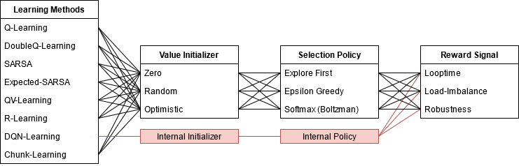

# LB4OMP with Reinforcement Learning #

> This repository is a fork of the original code at: <https://github.com/unibas-dmi-hpc/LB4OMP>. It extends the original work with an automatic method for scheduling algorithm selection based on reinforcement learning. The original README is available [here](./README.rst).

This extension provides a reinforcement learning implementation of common learning algorithm for RL agents to select a dynamic loop scheduling algorithm automatically during runtime. The following learning algorithms and other combinations are supported:

| Learning Method  |   | Value Initializer |   | Selection Policy   |   | Reward Signal  |
|------------------|---|-------------------|---|--------------------|---|----------------|
| Q-Learning       |   | Zero              |   | Explore First      |   | Looptime       |
| DoubleQ-Learning |   | Random            |   | Epsilon Greedy     |   | Load-Imbalance |
| SARSA            |   | Optimistic        |   | Softmax (Boltzman) |   | Robustness     |
| Expected-SARSA   |   |                   |   |                    |   |                |
| QV-Learning      |   |                   |   |                    |   |                |
| R-Learning       |   |                   |   |                    |   |                |
| DQN-Learning     |   |                   |   |                    |   |                |
| Direct-Chunk     |   |                   |   |                    |   |                |

## Usage ##

| Environment Variable | Description                                                                                                                                                                                                                                                                                                                                 | Possible Values                                | Default         |
|----------------------|---------------------------------------------------------------------------------------------------------------------------------------------------------------------------------------------------------------------------------------------------------------------------------------------------------------------------------------------|------------------------------------------------|-----------------|
| OMP_SCHEDULE         | Sets the schedule for loops annotated with the keyword "runtime". While there are many scheduling methods available to choose from, we only list the values introduced in this paper.                                                                                                                                                       | auto,[6 .. 15]                                 | -               |
| KMP_RL_INIT          | Sets the initialization method for the tabular data structure of the agent.                                                                                                                                                                                                                                                                 | ['zero', 'random', 'optimistic']               | 'zero'          |
| KMP_RL_POLICY        | Sets the action selection policy of the agent.                                                                                                                                                                                                                                                                                              | ['explore_first', 'epsilon_greedy', 'softmax'] | 'explore_first' |
| KMP_RL_REWARD        | Sets the metric that the agent uses to derive the reward.                                                                                                                                                                                                                                                                                   | ['looptime', 'load_imbalance', 'robustness']   | 'looptime'      |
| KMP_RL_ALPHA         | The learning rate (or step size) α determines to what extent newly acquired information overrides old information. A factor of 0 makes the agent learn nothing (exclusively exploiting prior knowledge), while a factor of 1 makes the agent consider only the most recent information (ignoring prior knowledge to explore possibilities). | [0 .. 1]                                       | 0.85            |
| KMP_RL_ALPHA_DECAY   | Factor by which to decay the learning rate α every timestep.                                                                                                                                                                                                                                                                                | [0 .. 1]                                       | 0.90            |
| KMP_RL_ALPHA_MIN     | Minimal value for the learning rate α for which the decay stops.                                                                                                                                                                                                                                                                            | [0 .. 1]                                       | 0.10            |
| KMP_RL_GAMMA         | The discount factor γ determines the importance of future rewards. A factor of 0 will make the agent "myopic" (short-sighted) by only considering current rewards, while a factor approaching 1 will make it strive for a long-term high reward.                                                                                            | [0 .. 1]                                       | 0.95            |
| KMP_RL_EPSILON       | With a small probability (1 - ε), we choose to explore a random action from the action space.                                                                                                                                                                                                                                               | [0 .. 1]                                       | 0.9             |
| KMP_RL_EPS_DECAY     | Factor by which to decay the exploration probability (1 - ε) after every timestep.                                                                                                                                                                                                                                                          | [0 .. 1]                                       | 0.9             |
| KMP_RL_EPS_MIN       | Minimal value for the exploration probability (1 - ε) for which the decay stops.                                                                                                                                                                                                                                                            | [0 .. 1]                                       | 0.1             |
